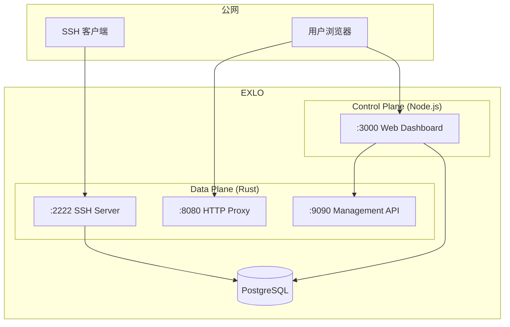
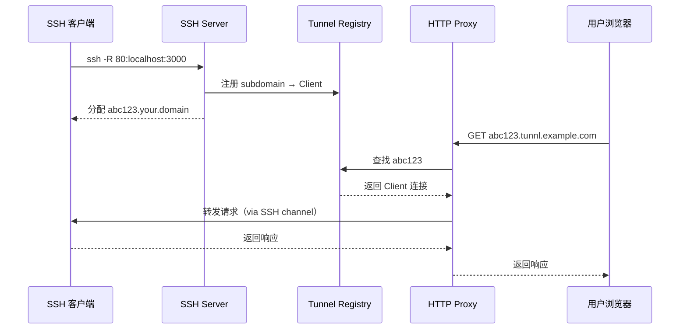
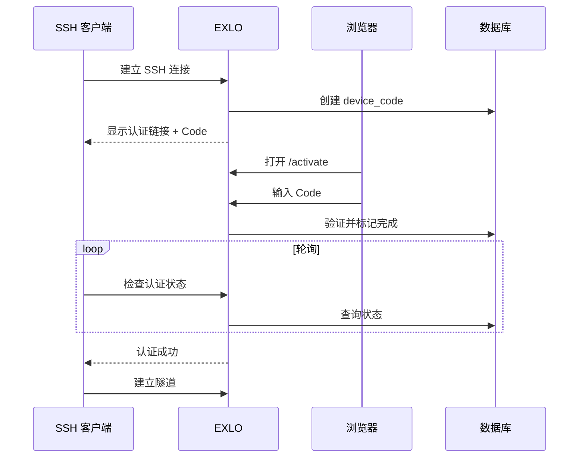

## 架构概览

EXLO 采用**双平面架构**，将流量处理与业务逻辑分离：

## 组件说明

### Data Plane (Rust)

高性能的流量处理层，负责：

- **SSH Server** (`:2222`) - 接收 `ssh -R` 连接请求
- **HTTP Proxy** (`:8080`) - 将请求路由到对应的隧道
- **Management API** (`:9090`) - 内部管理接口

### Control Plane (Node.js)

Web 管理层，负责：

- **用户认证** - Device Flow、邀请链接
- **隧道监控** - 实时显示活动连接
- **管理操作** - 终止连接、访问日志

## Virtual Bind 机制

EXLO 使用 **Virtual Bind** 替代传统的端口绑定：

传统 SSH 反向隧道会在服务器上绑定真实端口。EXLO 通过子域名路由，实现：

- **多租户隔离** - 不同用户使用独立子域名
- **无端口冲突** - 所有隧道共用 `:8080`
- **动态分配** - 自动生成唯一子域名

## Device Flow 认证

为支持无头环境（CI/CD、服务器），采用 OAuth 2.0 Device Flow：

## 端口与协议

| 端口 | 协议 | 方向 | 说明 |
|------|------|------|------|
| `:2222` | SSH | 入站 | 隧道连接入口 |
| `:8080` | HTTP/HTTPS | 入站 | 隧道流量代理 |
| `:3000` | HTTP | 入站 | Web Dashboard |
| `:9090` | HTTP | **仅内部** | Management API |
| `:5432` | PostgreSQL | **仅内部** | 数据库 |

> [!CAUTION]
> `:9090` Management API 允许无认证终止任意连接，**禁止**暴露到公网！
