## Architecture Overview

EXLO adopts a **dual-plane architecture**, separating traffic processing from business logic:

## Component Overview

### Data Plane (Rust)

High-performance traffic processing layer, responsible for:

- **SSH Server** (`:2222`) - Receives `ssh -R` connection requests
- **HTTP Proxy** (`:8080`) - Routes requests to corresponding tunnels
- **Management API** (`:9090`) - Internal management interface

### Control Plane (Node.js)

Web management layer, responsible for:

- **User Authentication** - Device Flow, invitation links
- **Tunnel Monitoring** - Real-time display of active connections
- **Management Operations** - Terminate connections, access logs

## Virtual Bind Mechanism

EXLO uses **Virtual Bind** instead of traditional port binding:

```mermaid
sequenceDiagram
    participant Client as SSH Client
    participant SSH as SSH Server
    participant Registry as Tunnel Registry
    participant Proxy as HTTP Proxy
    participant User as User Browser

    Client->>SSH: ssh -R 80:localhost:3000
    SSH->>Registry: Register subdomain → Client
    SSH-->>Client: Assign abc123.your.domain

    User->>Proxy: GET abc123.tunnel.example.com
    Proxy->>Registry: Lookup abc123
    Registry-->>Proxy: Return Client connection
    Proxy->>Client: Forward request (via SSH channel)
    Client-->>Proxy: Return response
    Proxy-->>User: Return response
```

Traditional SSH reverse tunnels bind real ports on the server. EXLO uses subdomain routing to achieve:

- **Multi-tenant Isolation** - Different users use independent subdomains
- **No Port Conflicts** - All tunnels share `:8080`
- **Dynamic Allocation** - Automatically generate unique subdomains

## Device Flow Authentication

To support headless environments (CI/CD, servers), OAuth 2.0 Device Flow is used:

## Ports and Protocols

| Port | Protocol | Direction | Description |
|------|----------|-----------|-------------|
| `:2222` | SSH | Inbound | Tunnel connection entry |
| `:8080` | HTTP/HTTPS | Inbound | Tunnel traffic proxy |
| `:3000` | HTTP | Inbound | Web Dashboard |
| `:9090` | HTTP | **Internal Only** | Management API |
| `:5432` | PostgreSQL | **Internal Only** | Database |

> [!CAUTION]
> `:9090` Management API allows unauthenticated termination of any connection. **Never** expose to the public internet!
