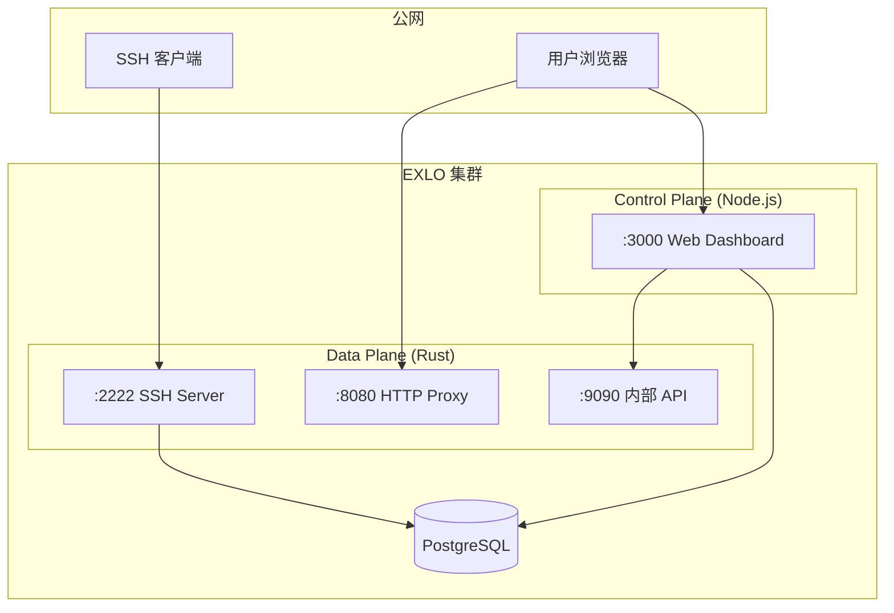

import { Cards, Card } from 'fumadocs-ui/components/card'

## 部署方式选择

EXLO 支持两种部署方式：

| 方式 | 配置文件 | 适用场景 |
|------|----------|----------|
| **简单部署** | `docker-compose.simple.yml` | 本地测试、内网使用、无域名场景 |
| **生产部署** | `docker-compose.yml` | 公网访问、需要域名和 SSL 证书 |

### 简单部署（端口访问）

无需域名，直接通过 `localhost:port` 或 `IP:port` 访问：

```bash
# 1. 复制环境变量
cp .env.simple.example .env

# 2. 启动服务
docker compose -f docker-compose.simple.yml up -d --build

# 3. 访问
# - Web Dashboard: http://localhost:3000
# - SSH: ssh -R 80:localhost:<本地端口> <code>@localhost -p 2222
# - 隧道代理: http://localhost:8080
```

### 生产部署（域名 + SSL）

使用 Traefik 反向代理 + Let's Encrypt 自动申请 SSL 证书：

```bash
# 1. 复制环境变量
cp .env.docker.example .env

# 2. 配置 .env 文件（必填项）
# - DOMAIN: 主域名（如 exlo.example.com）
# - TUNNEL_DOMAIN: 隧道域名（如 tunnel.example.com）
# - ACME_EMAIL: Let's Encrypt 邮箱
# - CF_API_EMAIL / CF_DNS_API_TOKEN: Cloudflare DNS 凭据
# - POSTGRES_PASSWORD: 数据库密码
# - BETTER_AUTH_SECRET: 认证密钥（至少 32 字符）
# - INTERNAL_API_SECRET: 内部 API 密钥（至少 32 字符）

# 3. 配置 DNS（在 Cloudflare 或其他 DNS 提供商）
# - A 记录: exlo.example.com -> 服务器 IP
# - A 记录: *.tunnel.example.com -> 服务器 IP（通配符）

# 4. 启动服务
docker compose up -d --build

# 5. 访问
# - Web Dashboard: https://exlo.example.com
# - SSH: ssh -R 80:localhost:<本地端口> <code>@exlo.example.com -p 2222
# - 隧道访问: https://<subdomain>.tunnel.example.com
```

## 架构概览

EXLO 采用 **Sidecar 模式**，由两个容器协同工作：



## 端口规划

| 端口 | 服务 | 暴露方式 | 说明 |
|------|------|----------|------|
| `:2222` | SSH Server | 公网 | 接受 `ssh -R` 连接 |
| `:8080` | HTTP Proxy | 公网（通过反向代理） | 处理 `*.your.domain` 请求 |
| `:3000` | Web Dashboard | 公网（通过反向代理） | 管理界面和认证 |
| `:9090` | Management API | **仅内部** | 不可暴露到公网 |
| `:5432` | PostgreSQL | **仅内部** | 数据库 |

> [!CAUTION]
> `:9090` Management API **禁止**暴露到公网！它允许终止任意连接，无需认证。


