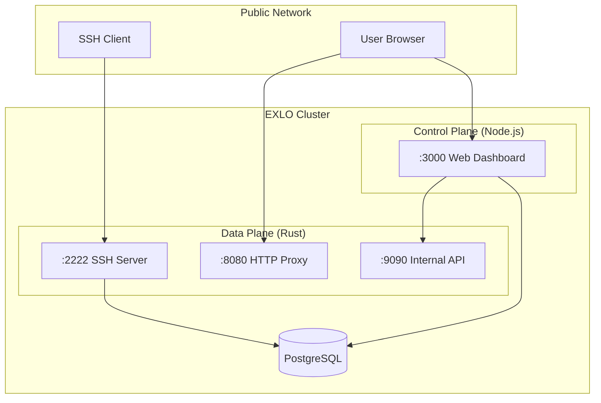

import { Cards, Card } from 'fumadocs-ui/components/card'

## Deployment Options

EXLO supports two deployment methods:

| Method | Config File | Use Case |
|--------|-------------|----------|
| **Simple Deployment** | `docker-compose.simple.yml` | Local testing, intranet use, no domain required |
| **Production Deployment** | `docker-compose.yml` | Public access, requires domain and SSL certificate |

### Simple Deployment (Port Access)

No domain required, access directly via `localhost:port` or `IP:port`:

```bash
# 1. Copy environment variables
cp .env.simple.example .env

# 2. Start services
docker compose -f docker-compose.simple.yml up -d --build

# 3. Access
# - Web Dashboard: http://localhost:3000
# - SSH: ssh -R 80:localhost:<local-port> <code>@localhost -p 2222
# - Tunnel Proxy: http://localhost:8080
```

### Production Deployment (Domain + SSL)

Uses Traefik reverse proxy + Let's Encrypt for automatic SSL certificates:

```bash
# 1. Copy environment variables
cp .env.docker.example .env

# 2. Configure .env file (required fields)
# - DOMAIN: Main domain (e.g., exlo.example.com)
# - TUNNEL_DOMAIN: Tunnel domain (e.g., tunnel.example.com)
# - ACME_EMAIL: Let's Encrypt email
# - CF_API_EMAIL / CF_DNS_API_TOKEN: Cloudflare DNS credentials
# - POSTGRES_PASSWORD: Database password
# - BETTER_AUTH_SECRET: Auth secret (at least 32 characters)
# - INTERNAL_API_SECRET: Internal API secret (at least 32 characters)

# 3. Configure DNS (at Cloudflare or other DNS provider)
# - A record: exlo.example.com -> Server IP
# - A record: *.tunnel.example.com -> Server IP (wildcard)

# 4. Start services
docker compose up -d --build

# 5. Access
# - Web Dashboard: https://exlo.example.com
# - SSH: ssh -R 80:localhost:<local-port> <code>@exlo.example.com -p 2222
# - Tunnel Access: https://<subdomain>.tunnel.example.com
```

## Architecture Overview

EXLO uses the **Sidecar Pattern**, with two containers working together:



## Port Planning

| Port | Service | Exposure | Description |
|------|---------|----------|-------------|
| `:2222` | SSH Server | Public | Accept `ssh -R` connections |
| `:8080` | HTTP Proxy | Public (via reverse proxy) | Handle `*.your.domain` requests |
| `:3000` | Web Dashboard | Public (via reverse proxy) | Management interface and authentication |
| `:9090` | Management API | **Internal Only** | Not exposed to public |
| `:5432` | PostgreSQL | **Internal Only** | Database |

> [!CAUTION]
> `:9090` Management API must **never** be exposed to the public internet! It allows terminating any connection without authentication.
