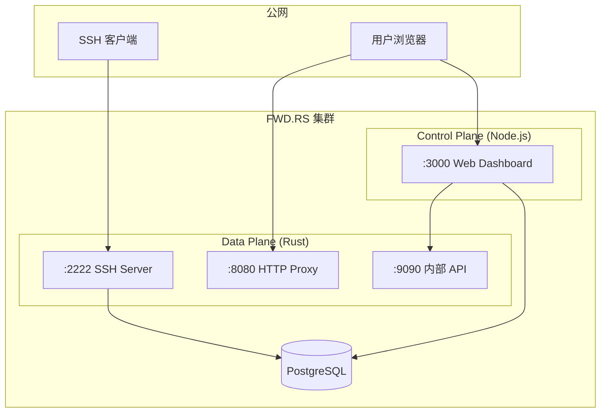

import { Cards, Card } from 'fumadocs-ui/components/card'

## 架构概览

FWD.RS 采用 **Sidecar 模式**，由两个容器协同工作：

## 端口规划

| 端口 | 服务 | 暴露方式 | 说明 |
|------|------|----------|------|
| `:2222` | SSH Server | 公网 | 接受 `ssh -R` 连接 |
| `:8080` | HTTP Proxy | 公网（通过反向代理） | 处理 `*.fwd.example.com` 请求 |
| `:3000` | Web Dashboard | 公网（通过反向代理） | 管理界面和认证 |
| `:9090` | Management API | **仅内部** | 不可暴露到公网 |
| `:5432` | PostgreSQL | **仅内部** | 数据库 |

> [!CAUTION]
> `:9090` Management API **禁止**暴露到公网！它允许终止任意连接，无需认证。
