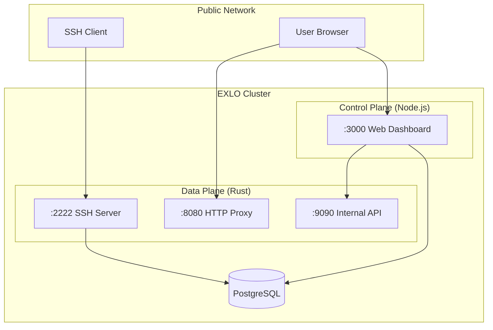

import { Cards, Card } from 'fumadocs-ui/components/card'

## Architecture Overview

EXLO uses the **Sidecar Pattern**, with two containers working together:

## Port Planning

| Port | Service | Exposure | Description |
|------|---------|----------|-------------|
| `:2222` | SSH Server | Public | Accept `ssh -R` connections |
| `:8080` | HTTP Proxy | Public (via reverse proxy) | Handle `*.your.domain` requests |
| `:3000` | Web Dashboard | Public (via reverse proxy) | Management interface and authentication |
| `:9090` | Management API | **Internal Only** | Not exposed to public |
| `:5432` | PostgreSQL | **Internal Only** | Database |

> [!CAUTION]
> `:9090` Management API must **never** be exposed to the public internet! It allows terminating any connection without authentication.
